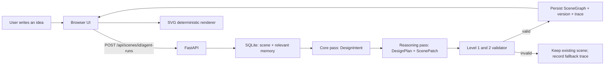

# CueSpace prototype architecture (Stages 0–6)

This document describes the local prototype that can run now. It deliberately separates what is implemented from later model and cloud work.

## What a request does



`POST /api/...` is not a layer "before FastAPI". It is the HTTP request the browser sends *to* a FastAPI route. The route coordinates storage, the planner, validation, and the response.

## The canonical data

The **SceneGraph** is JSON describing the editable state: objects, lights, positions, dimensions, colors, relations, and a version number. It is not an image and does not have to be saved as one. The renderer turns that JSON into the visible stage. A future exported PNG is a separate asset.

A **ScenePatch** is a small proposed change to a known version of a SceneGraph, for example `update_light(window-01)` or `add_object(sofa-01)`. It is safer than allowing a model to replace the whole scene. The patch carries `baseVersion`; if a user edit happened first, the patch is rejected rather than overwriting it.

## Storage in the local prototype

| Place | Stores | Why |
| --- | --- | --- |
| Browser | UI state and the current scene id | interaction only; not canonical |
| SQLite `data/cuespace.db` | SceneGraph, immutable scene versions, concise scene/project memories, agent runs and traces | one-user local source of truth |
| `uploads/` (future) | original sketches/reference images | object storage is file storage, not a SceneGraph database |
| Hosted model runtime (Stage 7) | temporary model execution state | not a permanent project database |

One run has one `run_id`. Its trace records request timing, logical passes, validator outcome, fallback status, and which memory entries were used. Thus latency/errors are fields of a trace record, not a competing kind of storage.

## Validation that is implemented now

- **Level 1 — structural:** valid patch operation, known ids, matching base version, valid ids for new objects/lights.
- **Level 2 — spatial:** movable objects stay within the stage, sizes are positive, heavy overlap is rejected, and a light cannot target a missing object.

Level 3 (stage-use logic) and Level 4 (aesthetic quality) remain future evaluation research. They should not be represented as solved by a rules-only prototype.

## Logical model roles and gateway boundary

The current `DeterministicCueSpaceAgent` has two **logical passes**, not two paid models:

1. **Core pass** converts text to a compact `DesignIntent`.
2. **Reasoning pass** turns that intent into an explainable `DesignPlan` and constrained ScenePatch.

Later, a single hosted Qwen model can be called twice through the same boundary: once with the core prompt and once with the reasoning/construction prompt. A Model Gateway is the internal service boundary that gives the app one common `run` shape even when an adapter changes from deterministic code to Qwen, OpenAI, or a VLM. It is neither the front-end/back-end boundary nor an API endpoint by itself. An adapter is the model-specific translation layer behind it.

## Run locally

Use two terminals from the repository root:

```powershell
.\.venv39\Scripts\python.exe -m uvicorn backend.app.main:app --reload --port 8000
python -m http.server 4173
```

Then visit `http://127.0.0.1:4173`. The backend docs are at `http://127.0.0.1:8000/docs`.

> The planner is intentionally deterministic until Stage 7. It is not an external LLM and must be described as a mock/planner baseline in demos.
